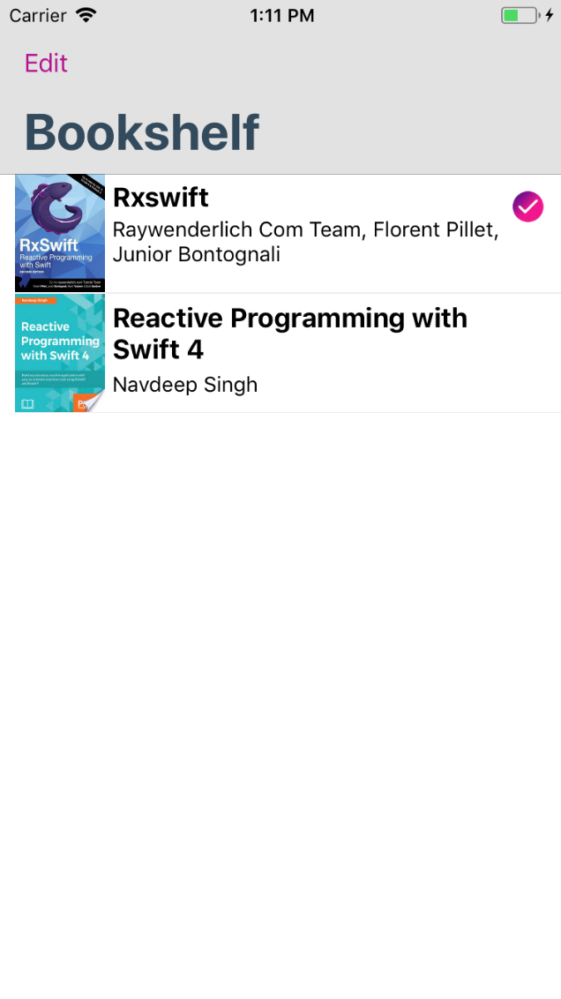
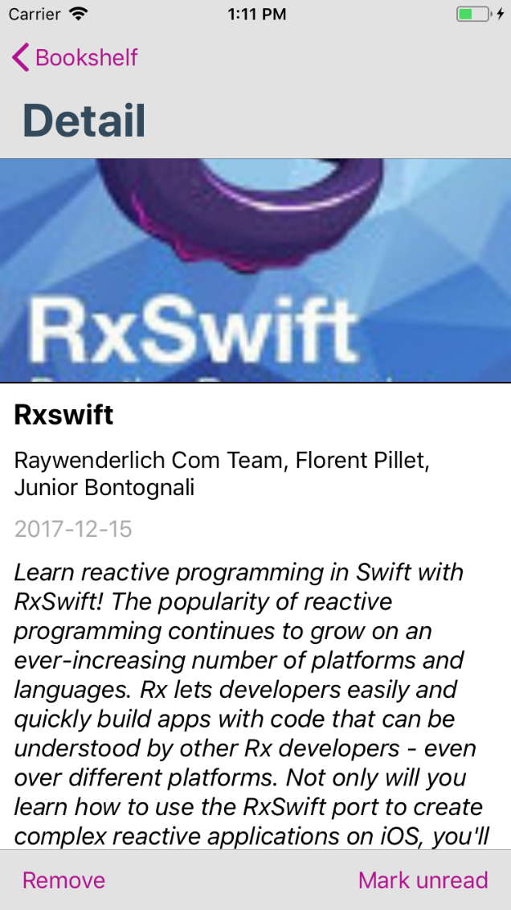
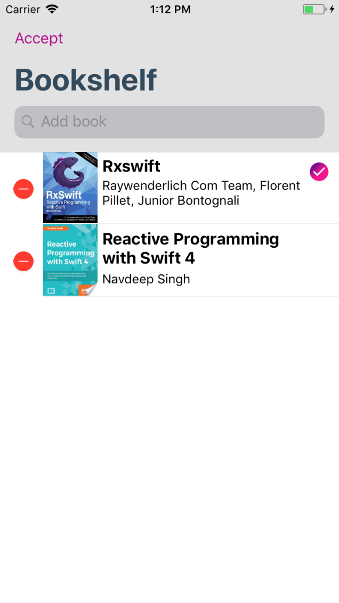
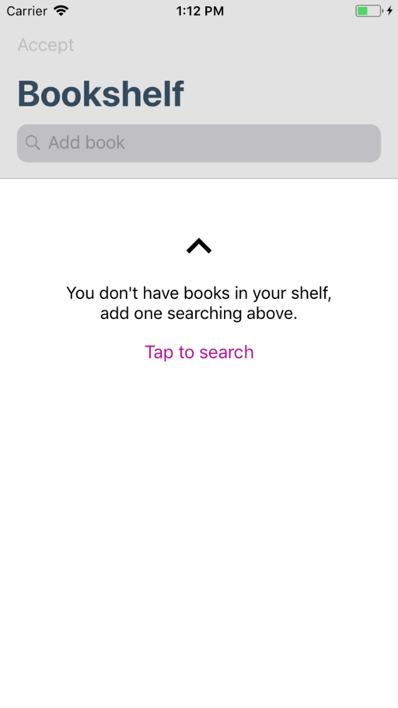
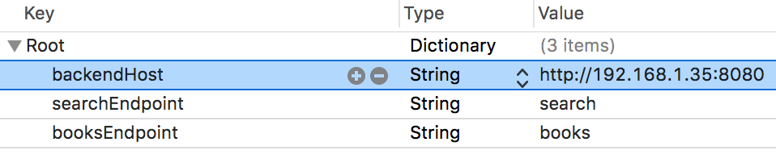

# RxBookshelf

Simple project of a bookshelf to learn Reactive programming in Swift with RxSwift.

   

# Installation

This project uses Carthage. Run 

`carthage update --configuration Debug --platform iOS` 

to install RxSwift frameworks in debug mode.

# Server

⚠️ In order to work, this app uses another personal project called [bookshelf-server](https://github.com/emenegro/bookshelf-server). Please, refer to the [Installation](https://github.com/emenegro/bookshelf-server#installation) section of project page to get the server up and running.

After that fill the IP of the server in the `Configuration.plist` file as follow:

### TODO
- Review memory management because there are RxSwift resources not being correctly disposed.
- Testing.

### License
This code is licensed under the [MIT License](LICENSE).
